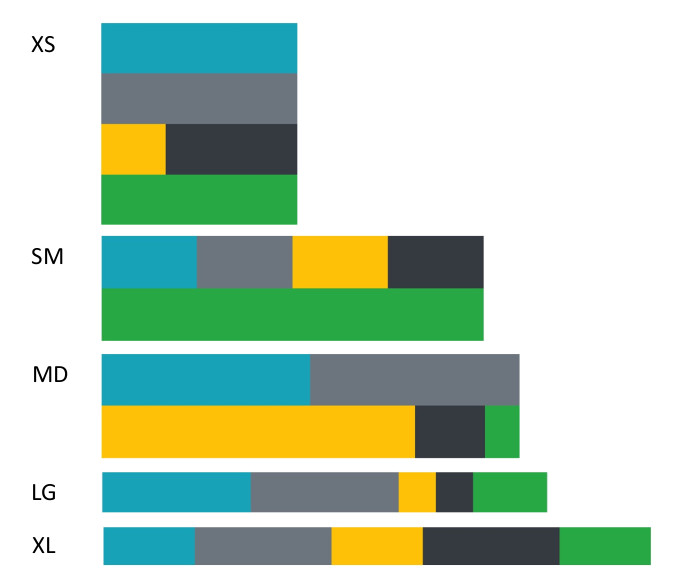

<h1>Maquetacion II</h1>

A partir del "ejemplo base", crea la siguiente maquetacion utilizando unicamente CSS propia (sin usar Bootstrap) con las siguientes caracteristicas:

<ul>
    <li>Asigna un identificador a cada capa de color</li>
    <li>Usa media-queries</li>
    <li>Aplica diseño mobile first</li>
</ul>
